# FoodPilot 🍔

FoodPilot is a personal AI food concierge powered by Swiggy's MCP (Model Context Protocol). Instead of endlessly scrolling through restaurant menus, you simply tell FoodPilot what you are craving. It curates the best options, remembers your address, and handles the entire checkout flow through a beautiful, conversational interface.

## The Problem It Solves
**Decision Fatigue.** Food delivery apps are built as search engines—they show you 500 options for "pizza" and force you to do the heavy lifting of comparing ratings, prices, and delivery times. 

FoodPilot shifts the cognitive load from the user to the machine. It acts as a trusted tastemaker. When you ask for pizza, it doesn't give you a list of 20 places. It gives you exactly two: the absolute best match based on ratings, and the best backup option running a discount. You just click a button and the food is on its way.

## Tech Stack
- **Backend:** FastAPI (Python)
- **Frontend:** React, TypeScript, TailwindCSS, Lucide Icons (I Used Loveable For The Frontend)
- **AI / LLM:** Claude 3.5 Sonnet (Anthropic API)
- **Database & Auth:** Supabase (PostgreSQL, Google OAuth)
- **Integration:** Swiggy MCP

## Challenges & How I Solved Them

**1. API Costs (Token Bloat)**
*Challenge:* Swiggy's MCP tool definitions are massive (around 12,000 tokens). Sending this entire schema to Claude on every single chat turn was burning through API credits insanely fast.

*Solution:* Implemented Anthropic's Prompt Caching in the backend. By setting `ephemeral` cache control blocks on the Swiggy schemas and system prompts, we dropped the input token cost per query by exactly **90%** (Anthropic's maximum cache-hit discount).  

**2. UI Jitter During Streaming**
*Challenge:* When streaming the LLM response directly into the UI, the text would arrive in unpredictable chunks, causing the chat bubble to stutter and jump abruptly.

*Solution:* Built a custom `queue-and-drain` mechanism on the frontend. The network stream dumps chunks into a background array, and a React `useEffect` interval smoothly drains the characters onto the screen at a steady 60fps, creating a buttery-smooth native feel.

**3. "No-Type" Ordering**
*Challenge:* Forcing users to type out "Please order option 1" or "Confirm my order" felt clunky for a concierge app. 

*Solution:* Designed a custom Quick Reply architecture. The AI secretly injects tags like `[BUTTON: Confirm Order]` at the end of its response. The React frontend intercepts these tags, hides them from the chat text, and renders them as clickable glassmorphism buttons. Clicking them instantly triggers the next action without the user typing a word.

**4. Secure Payment Handoff (API Limitations)**
*Challenge:* For security and RBI compliance, Swiggy's API actively blocks third-party automated checkouts to prevent unauthorized UPI/Card transactions. 

*Solution:* Designed a "Secure Hand-off Architecture". The AI autonomously handles the heavy lifting of curating items and syncing the cart to Swiggy's backend. At checkout, it gracefully catches the API restriction and directs the user to open their native Swiggy app to securely complete the final payment using biometrics, keeping their finances completely safe.

## How to Run Locally

### Prerequisites
You will need API keys for Anthropic and Supabase, and access to Swiggy MCP.

### Backend Setup
1. Clone the repository.
2. Install Python dependencies: `pip install -r requirements.txt`
3. Set up your `.env` file with your Supabase and Anthropic keys.
4. Run the backend server:
   ```bash
   uvicorn foodpilot.main:create_app --factory --reload --port 8000
   ```

### Frontend Setup
1. Navigate to the `frontend` folder.
2. Install Node dependencies: `npm install`
3. Start the Vite dev server:
   ```bash
   npm run dev
   ```
4. Open `localhost:5173` in your browser, log in via Google, connect your Swiggy account, and start ordering!

## High-Level Design (Sequence Diagram)

```mermaid
sequenceDiagram
    autonumber
    actor User
    participant Frontend as React Frontend
    participant Backend as FastAPI Backend
    participant DB as Supabase DB
    participant Claude as Claude 3.5 Sonnet
    participant Swiggy as Swiggy MCP Server

    User->>Frontend: Types "Order Biryani"
    Frontend->>Backend: POST /chat (User Message)
    
    rect rgb(30, 30, 30)
    Note right of Backend: 1. Setup & Context
    Backend->>DB: Fetch & Decrypt Swiggy Token
    DB-->>Backend: Plaintext Swiggy Token
    Backend->>DB: Fetch Chat History
    DB-->>Backend: Recent Messages
    end

    rect rgb(30, 30, 30)
    Note right of Backend: 2. AI & Autonomous Tool Execution
    Backend->>Claude: Send Prompt + History + MCP Config (w/ Token)
    Claude->>Swiggy: Fetch MCP Tool Schema (Cached)
    Swiggy-->>Claude: Tools (search_restaurants, update_cart, etc.)
    
    Claude->>Swiggy: Call get_addresses()
    Swiggy-->>Claude: Returns Home, Work
    Claude->>Swiggy: Call search_restaurants("Biryani", addressId)
    Swiggy-->>Claude: Returns Paradise, Behrouz
    Claude->>Swiggy: Call update_food_cart(...)
    Swiggy-->>Claude: Cart updated successfully
    end

    rect rgb(30, 30, 30)
    Note right of Claude: 3. Streaming Response
    Claude-->>Backend: Streams conversational response
    Backend-->>Frontend: Server-Sent Events (SSE stream)
    Frontend-->>User: Renders text at 60fps & displays UI buttons
    end
```


