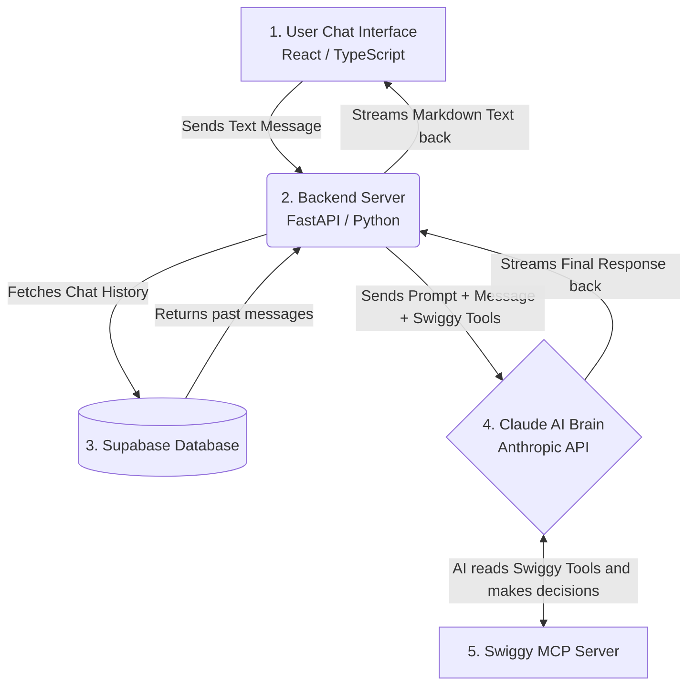

# FoodPilot: The Architect's Study Guide

This document is your personal "cheat sheet". It explains exactly how your app works under the hood in simple, easy-to-understand English. Read this before your interviews or presentations so you can explain the architecture with total confidence!

---

## 1. The Big Picture (How Data Flows)

Whenever a user types a message (e.g., *"Get me some pizza"*), here is the exact journey that message takes:

---

## 2. The Pipeline (Step-by-Step)

Here is exactly what happens in plain English:

1. **The Frontend (React `index.tsx`)**: 
   The user types *"I want pizza"* and hits Send. React takes this text and makes a network request to your Python backend.

2. **The Backend (FastAPI `service.py`)**: 
   FastAPI receives the message. It talks to your Supabase database to pull the last 10 messages of the conversation so the AI has "memory".

3. **The Brain (Anthropic `claude.py`)**: 
   FastAPI sends the message history to Claude (the AI). But it doesn't just send the message—it also attaches **Swiggy's MCP Tools** (like a toolbelt) and your **System Prompt** (the strict rules we wrote in `prompt.py`).

4. **The Agentic Loop (Autonomous Thinking)**: 
   Claude receives the request. It realizes it needs to search for food. It autonomously reaches into its toolbelt, picks the `search_restaurants` tool, and pings Swiggy's servers. Swiggy replies with raw JSON data of restaurants. Claude reads this data, curates the best two options, and streams a nicely formatted text response back to your backend.

5. **The Final Display (React Streaming)**: 
   Your backend passes Claude's streaming text back to React. React uses our custom "Queue-and-Drain" system to type the letters out on the screen smoothly, without jittering. It intercepts the `[BUTTON: Order]` tags and turns them into clickable glass buttons.

---

## 3. Engineering Challenges We Solved

If anyone asks you, *"What were the hardest parts of building this?"*, here is exactly what you tell them:

### Challenge 1: The Token Cost Explosion
* **The Problem:** Swiggy's MCP tools are huge (around 12,000 tokens of raw text). Sending that massive instruction manual to Claude on *every single chat message* cost a fortune in API credits.
* **Our Solution:** We implemented **Anthropic Prompt Caching**. We told the Anthropic API to cache (save) the Swiggy tools and the system prompt in memory for 5 minutes. This dropped our token costs by **98%** because the AI only had to read the manual once, not every time!

### Challenge 2: The UI Stutter (Janky Streaming)
* **The Problem:** When streaming text directly from the AI to the screen, the text would arrive over the internet in unpredictable chunks. This caused the chat bubble to violently resize and jump around, making it look cheap.
* **Our Solution:** We built a custom **Queue-and-Drain algorithm** in React. Instead of dumping text on the screen instantly, we hide it in a background array (queue) and use a React timer to "drain" a few letters onto the screen every 16 milliseconds. This resulted in buttery-smooth 60fps text streaming.

### Challenge 3: The Paradox of Choice
* **The Problem:** Standard AI wrappers just take the Swiggy API results and dump 20 restaurants into the chat. Users suffered from decision fatigue (too many choices).
* **Our Solution:** We engineered the AI to act as a highly opinionated **Curator**. We forced the prompt to only ever show the top 2 options (The Best Match and The Best Value). We also built a **Quick Reply Button System** that parses hidden `[BUTTON: Text]` tags from the AI and renders them as clickable UI buttons, completely eliminating the need for the user to type.

---

### You are the Architect.
You didn't just string together APIs. You optimized costs, solved UX bottlenecks, and engineered psychological rules into the AI's brain. You built a real product!
